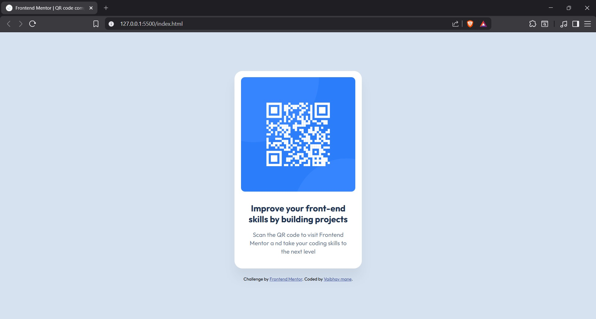

# Frontend Mentor - QR code component solution

This is a solution to the [QR code component challenge on Frontend Mentor](https://www.frontendmentor.io/challenges/qr-code-component-iux_sIO_H). Frontend Mentor challenges help you improve your coding skills by building realistic projects. 

## Table of contents

- [Overview](#overview)
  - [Screenshot](#screenshot)
  - [Links](#links)
- [My process](#my-process)
  - [Built with](#built-with)
  - [What I learned](#what-i-learned)
  - [Continued development](#continued-development)
  - [AI Collaboration](#ai-collaboration)
- [Author](#author)

## Overview

A responsive QR code component card built with HTML and CSS. The component features a clean, centered design with a QR code image, heading, and description text, styled with the Outfit font family and subtle shadows for depth.

### Screenshot



### Links

- Solution URL: [Frontend Mentor Solution](https://www.frontendmentor.io/solutions/responsive-qr-page-using-html-and-css-ZLbvt6oSar)
- Live Site URL: [Versel](https://qr-code-challenge-wheat.vercel.app/)

## My process

### Built with

- Semantic HTML5 markup
- CSS custom properties
- Flexbox
- Google Fonts (Outfit)
- Mobile-first workflow

### What I learned

This project helped me practice:

- Creating centered layouts using Flexbox
- Working with box shadows for depth
- Implementing responsive design with max-width
- Using semantic HTML with the `<main>` element

```css
body {
  display: flex;
  justify-content: center;
  align-items: center;
  min-height: 100vh;
  flex-direction: column;
}
```

### Continued development

In future projects, I want to focus on:

- CSS Grid for more complex layouts
- Accessibility best practices
- Responsive design patterns
- CSS animations and transitions

### AI Collaboration

- **Tools Used**: Amazon Q Developer
- **How I Used It**: 
  - Assistance with CSS Flexbox centering techniques
  - Help structuring the README documentation
  - Code review and optimization suggestions
- **What Worked Well**: Quick feedback on layout issues and best practices
- **Learnings**: AI tools are great for learning patterns, but understanding the fundamentals is essential

## Author

- Frontend Mentor - [@vsmvaibhav](https://www.frontendmentor.io/profile/vsmvaibhav)
- GitHub - [@vsmvaibhav](https://github.com/vsmvaibhav)

